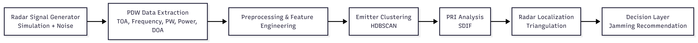
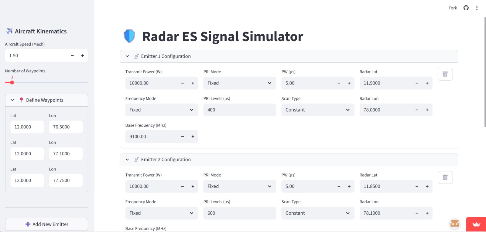
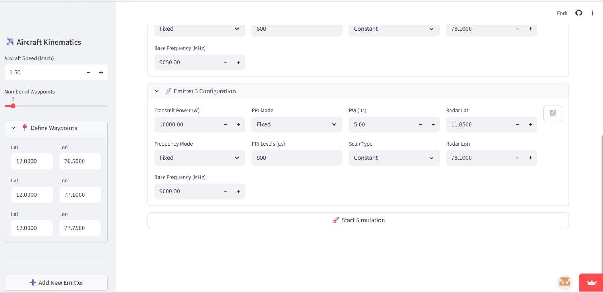

# Radar Emitter Identification, Localization & Jamming Recommendation for Electronic Warfare

## Overview

This project implements an end-to-end radar signal analysis pipeline for emitter identification, localization, and jamming recommendation using machine learning and signal processing techniques. The system simulates radar pulse environments, processes Pulse Descriptor Word (PDW) data, performs clustering-based emitter identification, estimates radar parameters, and provides decision support for electronic warfare scenarios.

The objective is to demonstrate how intelligent signal processing and machine learning can support automated threat analysis in complex and noisy environments.

---

## System Architecture

The overall processing pipeline follows these stages:

Radar Signal Generator → PDW Data Extraction → Data Preprocessing → Feature Normalization → Emitter Clustering → PRI Analysis → Radar Localization → Jamming Recommendation

(Architecture diagram will be added here)

---

## Processing Pipeline

### 1. Radar Signal Generator

- Radar emission simulation
- Aircraft motion modeling
- Noise injection for realistic environments
- Synthetic PDW generation

### 2. Data Processing & Feature Engineering

- Data cleaning and filtering
- Feature extraction from PDW parameters
- Feature normalization and scaling

### 3. Radar Identification

- Density-based clustering using HDBSCAN
- Pulse train extraction
- PRI detection using Sequential Difference Histogram (SDIF)
- Radar parameter estimation

### 4. Localization Module

- Bearing estimation
- Coordinate transformation (Geodetic ↔ ECEF)
- Bearing-only triangulation
- Least-squares optimization

### 5. Decision Layer

- Threat assessment logic
- Electronic warfare decision support
- Jamming recommendation generation

---

## Technologies Used

**Programming Language**

- Python

**Libraries & Tools**

- NumPy
- Pandas
- SciPy
- HDBSCAN
- PyArrow (Parquet storage)
- Matplotlib / Seaborn (visualization)

---

## Key Concepts Implemented

- Radar Signal Simulation
- Noise Modeling
- Density-Based Clustering
- Sequential Difference Histogram (SDIF)
- PRI Pattern Analysis
- Bearing-Only Localization
- Coordinate Transformations
- Least-Squares Optimization
- Electronic Warfare Decision Support

---

## Results

- Processed **2+ million radar pulse samples**
- Achieved approximately **85% classification accuracy** under noisy conditions
- Successfully demonstrated emitter identification and localization pipeline

(Result visualizations and graphs will be added here)

---

## Applications

- Electronic warfare systems
- Radar signal intelligence
- Defense analytics
- Autonomous threat monitoring systems

---

## Future Improvements

- Deep learning-based emitter classification
- Real-time streaming data processing
- Multi-sensor data fusion
- Advanced jamming strategy optimization

---

## Repository Structure
adar-emitter-identification-ew/
│── README.md
│── requirements.txt
│
├── docs/
├── src/
├── notebooks/
└── results/

## Prototype Demonstration (Work in Progress)

The following screenshots illustrate the initial radar signal simulation environment and system interface used during development.

### Simulation Interface

### System Prototype

## Results

The system is currently under development with preliminary validation performed on simulated radar pulse datasets. Initial experiments demonstrate the feasibility of emitter clustering and parameter estimation under noisy conditions. Detailed quantitative evaluation will be included in future updates.

**Status:** 🚧 Work in Progress

notebooks/demo.ipynb

